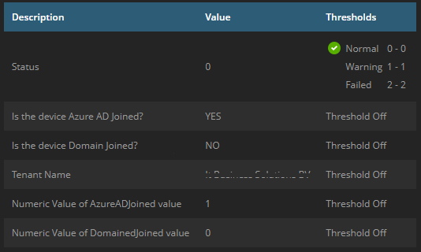

## Service Details

The Azure AD Join Status monitoring checks if a device is added in Azure AD using the dsregcmd.exe /status command.

This service is made to show up in n-central, as you can see in the example below

## Output Details

* Is the device Azure AD Joined? (Returns either YES or NO)
* Is the device Domain Joined? (Returns either YES or NO)
* Tenant Name (Returns the name of the tenant connected, will only show up if Device is Azure AD Joined)
* Numeric Value of AzureAdJoined value (Returns either 0 or 1 (0 = NO, 1 = YES))
* Numeric Value of DomainJoined value (Returns either 0 or 1 (0 = NO, 1 = YES))
* Status: (Returns either 0, 1 or 2)
0 = Azure Joined - 1 = Hybrid Joined - 2 = Not Connected
